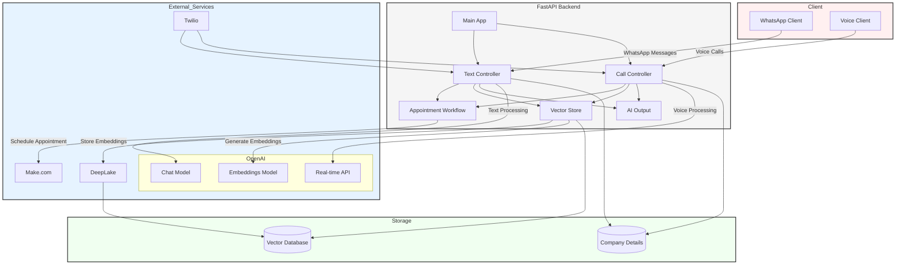

# ConvoPro - Your way to faster and efficient AI customer service

<div align="center">

[](https://www.python.org/)
[](https://fastapi.tiangolo.com/)
[](https://openai.com/)
[](https://www.langchain.com/)
[](https://www.twilio.com/)
[](https://www.activeloop.ai/)
[](https://www.make.com/)
[](https://ngrok.com/)
[](https://opensource.org/licenses/MIT)

</div>

## Introduction
**ConvoPro** is an innovative conversational platform designed to enhance communication and engagement through intelligent dialogue systems. With a focus on user-centric design, ConvoPro enables seamless interactions, making it ideal for businesses looking to improve customer service, automate responses, schedule appointments and facilitate meaningful conversations. 

This project supports both text and call services, utilizing the **OpenAI Chat Completions model** for text interactions and the **OpenAI RealTime API Beta** for voice communication. Unlike traditional voice agents that rely on a speech-to-text-to-text-speech approach, ConvoPro leverages advanced **speech-to-speech capabilities**, providing a more natural and efficient conversational experience.

ConvoPro empowers developers and organizations to build robust conversational agents that can adapt to various contexts and user needs, ultimately driving better outcomes and satisfaction.

## Table of Contents
- [Features](#features)
- [Architecture](#architecture)
- [Prerequisites](#prerequisites)
- [Installation](#installation)
- [Usage](#usage)
- [Contributing](#contributing)
- [Acknowledgements](#acknowledgements)
- [License](#license)

## Features
- Real-time voice communication using WebSocket and OpenAI RealTime API Beta
- Text-based chat functionality using OpenAI Chat Completions model
- Intelligent appointment scheduling system
- Vector store integration for knowledge base management
- Session management with timeout handling
- Rate limiting and error handling
- Comprehensive logging system
- CORS support for cross-origin requests


## Architecture

The application is structured into several key components:

- `main_app.py` - Application entry point and configuration
- `app_call.py` - Voice communication handling
- `app_text.py` - Text communication handling
- `storage.py` - Vector store and data persistence
- `ai_output.py` - AI model integration
- `appointment_call.py` - Appointment scheduling logic



## Technologies Used
- Python 3.9+
- FastAPI (for API endpoints)
- OpenAI (for LLM and Embeddings)
- Langchain (for LLM integration)
- Activeloop Token (for DeepLake vector store)
- Twilio account (for WhatsApp and Voice functionality)
- Ngrok (for local server hosting)
- Make.com (for scheduling appointments workflow)

## Installation

### 1. Clone the repository:
```bash
git clone https://github.com/yourusername/ConvoPro.git
cd ConvoPro
```
### 2. Create and activate a virtual environment: (Optional)
```bash
python -m venv convo-pro-env
source convo-pro-env/bin/activate
```
### 3. Install the dependencies:
```bash
pip install -r requirements.txt
```
### 4. Set up Activeloop Token:
Activeloop provides vector databse to storage embeddings from the data gathered. This will be retrieved by the underlying LLM (in this case GPT-4o) to retrieve relevant information for user queries.

>Create your ActiveLoop account by going tothis link : https://app.activeloop.ai/

Create an **ActiveLoop Token** and paste it securely in a file, this will be useful to connect your app with the databse.

Further you need to create an **organization** (a project like structure where all you dataset will be store) on activeloop and copy the name of the organization you created

### 5. Create OpenAI Key:

>Go to this link https://openai.com/index/openai-api/

To access the Embeddings and GPT model in the app, you'll need to add some OpenAI credits. For personal use, it doesn't require much—you can start with as little as $5-$10, which should be enough to last 2-3 months depending on your usage.

Sign up and create your **OpenAI API Key**. Copy the api key and store it securely.

### 6. Create Twilio Account

Setup a Twilio account and get your **Twilio Account SID** and **Auth Token** from the Twilio dashboard.

Sign up for a phone number under the Phone Numbers section which should cost around $1-$1.5 per month. Save the phone number in a file securely.

Setup WhatsApp Sandbox environment for testing or upgrade to paid plan under the Messaging section.

### 8. Create a Make.com account for scheduling appointments workflow
>Go to this link https://make.com/

Create an account and go to the scenario section and create a new scenario.

Look for the more icon in the control sections and select export scenario. Browse the blueprint provided in the repository name as **make_blueprint.json** and import it into your scenario.

Once the scenario is imported, you shoudl be able to see the a webhook url when you click on the **webhook** module. Copy the webhook url and store it securely in a file.

### 7. Setup environment variables and Deeplake :
    
Open the .env file replace the respective place holders with your API keys
    
.env
```bash
ACTIVELOOP_TOKEN="<YOUR_ACTIVELOOP_TOKEN>"
OPENAI_API_KEY="<YOUR_OPENAI_API_KEY>"
TWILIO_ACCOUNT_SID="<YOUR_TWILIO_ACCOUNT_SID>"
TWILIO_AUTH_TOKEN="<YOUR_TWILIO_AUTH_TOKEN>"
TWILIO_PHONE_NUMBER="<YOUR_TWILIO_PHONE_NUMBER>"
WEBHOOK_URL="<YOUR_MAKE_COM_WEBHOOK_URL>"
```

Open vectordb.py script and replace the organization name placeholder with the one you created and the dataset name placeholder with the name of the deeplake dataset you want to create.
    
**Note:** You only need to create the organization on ActiveLoop, the dataset will be created at the runtime with the name you provided on it own.

storage.py
```bash
self.activeloop_org = "<YOUR_ACTIVELOOP_ORGANISATION_NAME>" # replace with your ActiveLoop organisation name
self.activeloop_dataset = "<DATASET_NAME>" # replace with your ActiveLoop dataset name you want to be created
```
### 8. Setup ngrok for local server hosting

>Go to this link https://ngrok.com/

Download and install ngrok and get the authtoken.


## Usage

### 1. Add knowledge base
There is an exmaple_knowledge_base file that exists. You can use that for trial purpose or update it with your own

Run the storage.py file
```bash
python storage.py
```

### 2. Start local host server
```bash
python main_app.py
```

### 3. Setup ngrok for local server hosting

Run ngrok by typing `ngrok http 8000` in the terminal.

Copy the https url provided by ngrok and go to the Twilio console.

In the WhatsApp sandbox, go to the settings section and select the edit option for the sandbox number.

Paste the https url in the whatsapp sandbox setting in thsi format:
>https://your-ngrok-url/text/whatsapp

In the Phone Number settings, find the active number and paste the https url in the webhook section in this format:
>https://your-ngrok-url/call/incoming-call


### 4. Test the app

You can now test the app by sending a message to the WhatsApp sandbox number or making a call to the active number. Have a conversation about the products or service or try booking an appointment.

## Contributing

We welcome contributions! Please follow these steps:

1. Fork the repository
2. Create a feature branch (`git checkout -b feature/AmazingFeature`)
3. Commit your changes (`git commit -m 'Add some AmazingFeature'`)
4. Push to the branch (`git push origin feature/AmazingFeature`)
5. Open a Pull Request

## Acknowledgements

This project makes use of several open-source libraries and services:
- [FastAPI](https://fastapi.tiangolo.com/)
- [OpenAI](https://openai.com/)
- [Langchain](https://www.langchain.com/)
- [DeepLake](https://www.activeloop.ai/)
- [Twilio](https://www.twilio.com/)
- [Ngrok](https://ngrok.com/)
- [Make.com](https://make.com/)

Special thanks to all contributors who have helped shape this project.

## License

This project is licensed under the MIT License - see the [LICENSE](LICENSE) file for details.
